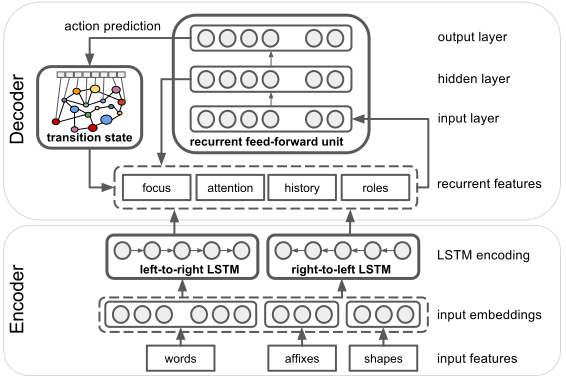

# SLING - A natural language frame semantics parser

## The SLING Project has moved

The SLING project has moved to https://github.com/ringgaard/sling. 

Please refer to the above repo for the latest developments on SLING.

## Background

The aim of the SLING project is to learn to read and understand Wikipedia
articles in many languages for the purpose of knowledge base completion, e.g.
adding facts mentioned in Wikipedia (and other sources) to the
[Wikidata](https://www.wikidata.org) knowledge base.
We use [frame semantics](doc/guide/frames.md) as a common representation for 
both knowledge representation and document annotation. The SLING parser can 
be trained to produce frame semantic representations of text directly without 
any explicit intervening linguistic representation.

The SLING project is still work in progress. We do not yet have a full system
that can extract facts from arbitrary text, but we have built a number of the
subsystems needed for such a system.
The SLING frame store is our basic framework for building and manipulating frame
semantic graph structures.
The [Wiki flow pipeline](doc/guide/wikiflow.md) can take a raw dump of Wikidata
and [convert](doc/guide/wikiflow.md#wikidata-import) this into one big frame
graph.
This can be loaded into memory so we can do fast graph traversal for inference
and reasoning over the knowledge base.
The Wiki flow pipeline can also take raw Wikipedia dumps and
[convert](doc/guide/wikiflow.md#wikipedia-import-and-parsing) these into a set
of documents with structured annotations extracted from the Wiki markup. This
also produces [phrase tables](doc/guide/wikiflow.md#name-and-phrase-tables) that
are used for mapping names to entities.
There is a [SLING Python API](doc/guide/pyapi.md) for accessing all this
information and we also have a [bot](python/wikibot) for uploading extracted
facts to Wikidata.

## The SLING Parser

The SLING parser is used for annotating text with frame semantic annotations.
It is a general transition-based frame semantic parser using bi-directional
LSTMs for input encoding and a Transition Based Recurrent Unit (TBRU) for output
decoding.
It is a jointly trained model using only the text tokens as input and the
transition system has been designed to output frame graphs directly without any
intervening symbolic representation.

The SLING framework includes an efficient and scalable
[frame store](doc/guide/frames.md) implementation as well as a
[neural network JIT compiler](doc/guide/myelin.md) for fast training and 
parsing.

A more detailed description of the SLING parser can be found in this paper:

* Michael Ringgaard, Rahul Gupta, and Fernando C. N. Pereira. 2017.
  *SLING: A framework for frame semantic parsing*. http://arxiv.org/abs/1710.07032.

## More information ...

  * [Installation and building](doc/guide/install.md)
  * [CASPAR frame semantics parser](doc/guide/caspar.md)
  * [Semantic frames](doc/guide/frames.md)
  * [SLING Python API](doc/guide/pyapi.md)
  * [Myelin neural network JIT compiler](doc/guide/myelin.md)
  * [Wikipedia and Wikidata processing](doc/guide/wikiflow.md)

## Credits

Original authors of the code in this package include:

*   Michael Ringgaard
*   Rahul Gupta
*   Anders Sandholm
