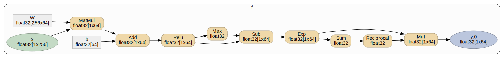
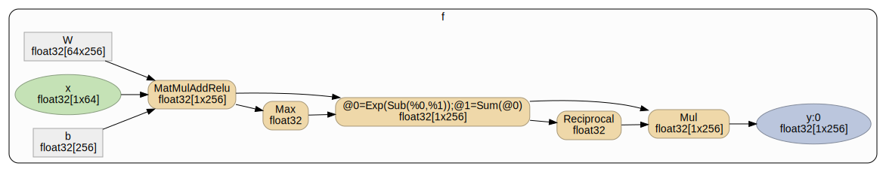

# Myelin - Neural network JIT compiler

Myelin is a just-in-time compiler for neural networks. It compiles a
_flow_ into x64 assembly code at runtime. The flow contains the graph for the
neural network computations as well as the learned weights from training the
network. The generated code takes the CPU features of the machine into account
when generating the code so it can take advantage of specialized features like
SSE, AVX, and FMA3.

Myelin can be used at inference time (as opposed to training time) to speed up
neural network computations. The neural network can be stored in a _.flow_ file
which can then later be loaded and compiled into a _network_ at runtime by
Myelin.

## Platform

Operating system: Linux<br>
Languages: C++, assembler, Python<br>
CPU: Intel x64 or compatible<br>
Build system: Bazel<br>

## Using Myelin in Python

Myelin represents a computation graph using a _flow_. The graph is divided into
_functions_ which can be computed independently. A function is a set of
_operations_ with tensor inputs and outputs. The tensor inputs and outputs are
_variables_ in the flow. Variables can either be global constant tensors, e.g.
learned weights in a neural network, or parameter tensors, which are local to
the function.

### Building a flow

Let's consider a simple neural network with a single linear layer with a
softmax on top:
```
y = softmax(relu(x * W + b))
```
This can be computed with the following flow graph:



The graph only shows the input and output variables (green and blue), and the
global variables (rectangles), but does not show the intermediate variables
between the tensor operations. The softmax is also expanded into more basic
operations, i.e.:
```
softmax(x) = normalize(exp(x - max(x)))
normalize(x) = x * (1 / sum(x))
```
You can use a `myelin.Builder` for constructing a flow function for this
computation:

```python
import sling
import sling.myelin as myelin
import numpy as np

# Build flow.
flow = myelin.Flow()

# Create builder for function.
f = myelin.Builder(flow, "f")
```

The weights in W and b can be initialized from NumPy arrays or any other
objects that support the
[Python buffer protocol](https://docs.python.org/2/c-api/buffer.html):

```python
# Initialize weights.
W = f.array("W", np.random.rand(64, 256).astype(np.float32))
b = f.array("b", np.random.rand(256).astype(np.float32))
```

Next, we create an input variable `x` and build up the computation using the
builder:

```python
# Create input variable x as a float[1,64] tensor.
x = f.var("x", myelin.DT_FLOAT, [1, 64])

# Compute y=softmax(relu(x * W + b))
y = f.softmax(f.relu(f.add(f.matmul(x, W), b)), name="y")
```

### Compiling a flow into a network

The flow is just a specification of the computation. It needs to be compiled
into a _network_. The Myelin JIT compiler converts the flow into assembly
code for executing the computation. Each function is compiled into a _cell_
which contains the data layout for the cell as well as the code for the
computation:

```python
# Compile flow to network.
compiler = myelin.Compiler()
net = compiler.compile(flow)
cell = net.cell("f")
```

The flow is first analyzed by the Myelin JIT compiler which transforms the
flow graph into an optimized form using more specialized operations:



In this example, the `MatMul`, `Add`, and `Relu` operations are converted into
a combined kernel doing all three in one operation. The `Exp`, `Sub`, and
`Sum` operations are also turned into a `Calculate` operation computing
`@0=Exp(Sub(%0,%1));@1=Sum(@0)` as one element-wise operation.

For each function, the compiler determines the optimal layout of the cell
instance data and selects kernels for implementing the operations and the
order of computation:
```
cell f {  // size 2336
  input var f/x: float32[1x64]    // offset 0 size 256 alignment 32 row-major
  var f/Relu:0: float32[1x256]    // offset 256 size 1024 alignment 32 row-major
  var f/Max:0: float32            // offset 1280 size 4 alignment 4 row-major linked to f/Sum:0
    union f/Sum:0: float32        // offset 1280 size 4 alignment 4 row-major linked to f/Reciprocal:0
    union f/Reciprocal:0: float32 // offset 1280 size 4 alignment 4 row-major linked to f/Max:0
  var f/Exp:0: float32[1x256]     // offset 1312 size 1024 alignment 32 row-major linked to f/y:0
    union f/y:0: float32[1x256]   // offset 1312 size 1024 alignment 32 row-major linked to f/Exp:0

  const f/W: float32[64x256]      // size 65536 alignment 32 row-major
  const f/b: float32[256]         // size 1024 alignment 32 row-major

  f/Relu:0 = AVXFltVecMatMulAddRelu[U8V](f/x, f/W, f/b)
  f/Max:0 = MaxExpr[VFltAVX256](f/Relu:0)
  f/Exp:0, f/Sum:0 = Calculate[VFltAVX256](f/Relu:0, f/Max:0)
  f/Reciprocal:0 = ReciprocalExpr[FltAVX](f/Sum:0)
  f/y:0 = MulExpr[VFltAVX256](f/Exp:0, f/Reciprocal:0)
}
```

Finally, the Myelin JIT compiler converts the optimized operations into
[assembler code](flowasm.txt) using the selected kernel generators. The code
generated for each function depends on the negotiated layout and alignment of
the input and output tensors as well as the features supported by the CPU (SSE,
AVX, AVX2, FMA3, AVX512, etc.).

### Computing using network cell instances

In order to do any computation with the compiled network, you need to create
a cell _instance_. If a cell is like a class, then an instance is like an object
of that class. A cell instance has memory for storing all the local variables
of a cell. You can create multiple instances of a cell, each with their own
set of local variables.

```python
# Create new data instance.
data = cell.instance()

# Set input.
xdata = data[x]
for i in range(64): xdata[0, i] = 5

# Run computation for data instance.
data.compute()

# Print result.
ydata = data[y]
print("y", ydata)
print("argmax", np.asarray(ydata).argmax())
```

The index operator on the cell object (e.g. `data[x]`) returns a _tensor_ object
for the variable in the cell instance with that name.
Alternatively, a numeric tensor parameter id can be used as as the index key.
The `cell.index(name)` method can be used for looking up tensor parameter ids in
advance, and looking up tensors by parameter ids is faster than looking up
tensors by name.
If the index key is neither a string nor an integer, the repr() function of the
index key is used for determining the tensor name.

The tensor is a view into the data in the instance for the variable. The tensor
elements can be read or modified using the index operator, e.g.
`xdata[0, i] = 5`. The tensor object also supports the Python buffer interface,
so you can create a NumPy array sharing the underlying data, e.g.
`np.asarray(ydata)`. You can use the `name()`, `rank()`,  `shape()`, and
`type()` methods for inspecting the tensor format.

The `compute()` method is used for running the cell instance computation, i.e.
compute the output tensor variables from the inputs tensor variables.
A cell instance can be reused for multiple computations. The `clear()` method
can be used for clearing all the tensors in the instance.

### Putting it all together

```python
import sling
import sling.myelin as myelin
import numpy as np

# Build flow.
flow = myelin.Flow()

# Create builder for function.
f = myelin.Builder(flow, "f")

# Initialize weights.
W = f.array("W", np.random.rand(64, 256).astype(np.float32))
b = f.array("b", np.random.rand(256).astype(np.float32))

# Create input variable x as a float[1,64] tensor.
x = f.var("x", myelin.DT_FLOAT, [1, 64])

# Compute y=softmax(relu(x * W + b))
y = f.softmax(f.relu(f.add(f.matmul(x, W), b)), name="y")

# Compile flow to network.
compiler = myelin.Compiler()
net = compiler.compile(flow)
cell = net.cell("f")

# Create new data instance.
data = cell.instance()

# Set input.
xdata = data[x]
for i in range(64): xdata[0, i] = 5

# Run computation for data instance.
data.compute()

# Print result.
ydata = data[y]
print("y", ydata)
print("argmax", np.asarray(ydata).argmax())
```

## Creating a flow file from a Tensorflow graph

Myelin uses [flow files](#flow-file-format) to store neural networks. A
Tensorflow graph can be stored as a flow file using the myelin Python module.
After the network has been trained, the parts of the Tensorflow graph needed
for inference can be exported to a flow file. The following is a simple example
of training a MNIST classifier and storing the resulting network in a flow
file:

```python
from tensorflow.examples.tutorials.mnist import input_data
import tensorflow as tf
from sling.myelin import Flow
from sling.myelin.tf import Extractor

# Import data.
mnist = input_data.read_data_sets("/tmp/mnist", one_hot=True)

# Create the model.
x = tf.placeholder(tf.float32, [None, 784], name='x')
W = tf.Variable(tf.zeros([784, 10]), name='W')
b = tf.Variable(tf.zeros([10]), name='b')
y = tf.add(tf.matmul(x, W), b, name='y')

# Define loss and optimizer.
y_ = tf.placeholder(tf.float32, [None, 10])
cross_entropy = tf.reduce_mean(
    tf.nn.softmax_cross_entropy_with_logits(labels=y_, logits=y))
train_step = tf.train.GradientDescentOptimizer(0.5).minimize(cross_entropy)

# Train model.
sess = tf.InteractiveSession()
tf.global_variables_initializer().run()
for _ in range(1000):
  batch_xs, batch_ys = mnist.train.next_batch(100)
  sess.run(train_step, feed_dict={x: batch_xs, y_: batch_ys})

# Save model to flow file.
flow = Flow()
extractor = Extractor(sess, flow)
extractor.add(flow.func("classifier"), [x], [y])
flow.save("/tmp/mnist.flow")
```

This will extract the parts of the TF graph needed for computing `y` from `x`.
It will add a _function_ (`classifier`) to the flow and then add the `MatMul`
and `Add` _operations_ to this function. It will also add `W` and `b` as
constant _variables_ to the flow with the trained weights. The resulting flow
is then saved to the file _/tmp/mnist.flow_.

## Using Myelin in C++

### Setting up a kernel library

```c++
#include "sling/myelin/compute.h"
#include "sling/myelin/kernel/tensorflow.h"

using namespace sling::myelin;

// Initialize library with kernels.
Library library;
RegisterTensorflowLibrary(&library);
```

Myelin uses a library of transformations and kernels for generating code
for the neural network. In this example we add generic kernels which can be
used on any x64 processor as well as specialized kernels for CPUs with
[AVX](https://en.wikipedia.org/wiki/Advanced_Vector_Extensions) support. You can
add your own kernel generators and graph transformations for custom ops or
for generating optimized code for special cases of standard ops.

### Compiling a network

```c++
// Load and compile neural network.
Network nn;
CHECK(nn.Compile("/tmp/mnist.flow", library));

// Get neural network cell for classifier.
Cell *classifier = nn.GetCell("classifier");

// Get classifier inputs and outputs.
Tensor *x = classifier->GetParameter("x:0");
Tensor *y = classifier->GetParameter("y:0");
```

Myelin can load and compile a flow file into a `Network` object. This contains
a _cell_ for for each function in the flow file. A `Cell` holds the generated
code for computing the cell function as well as a description of the data layout
for all the parameters used by the computation. The parameters can be input
(e.g. `x`), output parameters (e.g. `y`), or intermediate values needed by the
cell computation. Constant parameters (e.g. `W` and `b`) are stored in the
`Network` object and can be shared between cells.

After the network has been compiled, the parameters can be looked up in the
cell or network. The `Tensor` object then knows the location of the parameter
in the compiled flow.

### Computing cell functions

```c++
// Create instance of neural network cell for classifying input.
Instance data(classifier);

// Set input for classification.
float *input = data.Get<float>(x);
<<< fill input array with image data >>>

// Classify input.
data.Compute();

// Get output prediction.
float *output = data.Get<float>(y);
<<< argmax of output distribution is the prediction >>
```

An `Instance` object is used for computing a cell function. The instance
allocates memory for all the input, output, and intermediate parameters for
the cell. Multiple instance objects can be created for a cell function and
computations on these different instances can be done concurrently.

When an instance for a cell has been allocated, the input parameters should be
filled into the instance. The `Compute()` method then invokes the generated code
for the cell and computes the output parameters from the input parameters (and
constant parameters). Then the values of the output parameters can be read from
the instance object.

An instance object can be used for multiple computations, but the `Clear()`
method needs to be called before the instance can be reused for another
computation.

## Flow file format

A flow file contains a trained neural network with variables, operations,
functions, connectors, and blobs. It is a simple binary file format with the
following structure:

```
flow = "flow" <version>
       <#flags> (unused, from version 5)
       <#vars> var*
       <#ops> op*
       <#funcs> func*
       <#cnxs> cnx*
       <#blobs> blob* (from version 4)

var = <#flags> (IN=1, OUT=2, REF=4, LEARNABLE=8 UNIQUE=16, from version 5)
      <name$>
      <#aliases> <alias$>*
      <dtype$>
      <shape>
      <#attrs> attr* (from version 6)
      <#bytes> value

op = <#flags> (unused, from version 5)
     <name$>
     <type$>
     <#inputs> <input$>*
     <#outputs> <output$>*
     <#attrs> attr*

blob = <#flags> (unused, from version 5)
       <name$>
       <type$>
       <#attrs> attr*
       <#bytes> data

func = <#flags> (TRAINING=1, from version 5)
       <name$>
       <#ops> <op$>*

cnx = <#flags> (unused, from version 5)
      <name$>
      <#vars> <var$>*

shape = <#dims> <size>*

attr = <name$> <value$>

dtype = "float16" | "float32" | "float64" | "int8" | "uint8" |
        "int16" | "uint16" | "int32" | "uint64"

"flow" = 0x776f6c66
version = 3 | 4 | 5 | 6
```

A flow file begins with the _magic_ string "flow" followed by a version number.
Numbers are encoded as 32-bit integers stored in little-endian format (aka Intel
format). Strings are stored as length-prefixed strings where the length is
encoded as a 32-bit integer. Constant data for variables are stored in numpy
ndarray row-major format with an unsigned 64-bit little-endian length prefix. If
a variable does not have any constant value, the length is zero.

