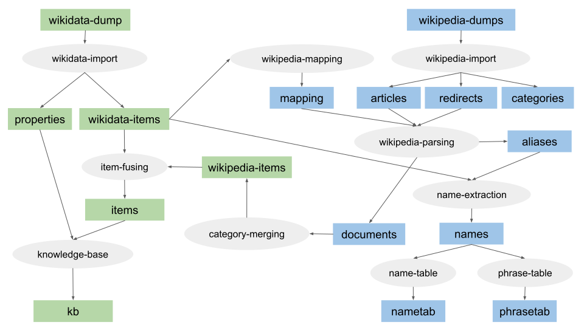
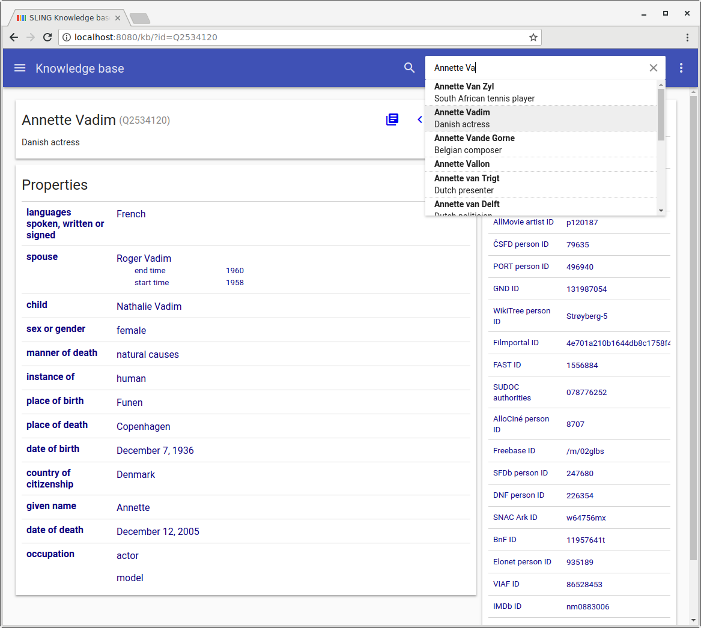

# SLING Wikipedia and Wikidata processing

SLING has a task processing pipeline for downloading and processing
[Wikipedia](https://www.wikipedia.org/) and [Wikidata](https://www.wikidata.org)
dumps. All Wikipedia pages and the Wikidata knowledge base are freely
available as dump files from [Wikimedia](https://www.wikimedia.org/). These
dumps are processed using the SLING workflow task system to convert the dumps
into SLING frame format.

## Processing overview



The Wiki processing pipeline performs the following tasks:

  * Download Wikidata and Wikpedia dumps
  * Import Wikidata dump (`wikidata-import`)
  * Import Wikipedia dump(s) (`wikipedia-import`)
  * Construct mapping from Wikipedia to Wikidata (`wikipedia-mapping`)
  * Wikipedia parsing (`wikipedia-parsing`)
  * Extract link graph from Wikipedia and Wikidata (`wiki-link`)
  * Merging of Wikipedia categories across languages (`category-merging`)
  * Inversion of category membership graph (`category-inversion`)
  * Fusing information about items to produce final item frame (`item-fusing`)
  * Build frame store with knowledge base (`knowledge-base`)
  * Extract and select aliases for entities from Wikidata and Wikipedia (`name-extraction`)
  * Build name table for searching for entities (`name-table`)
  * Build phrase table for matching phrases in text to entities (`phrase-table`)

After [installing and building SLING](install.md), the `./run.sh` script can be
used for running the pipeline:
```
./run.sh --help
```

## Download dumps

First, the Wikipedia and Wikidata dumps need to be downloaded:
```
./run.sh --download_wikidata --download_wikipedia
```
These dumps are large, so it might take a while to download.
For example, Wikidata and just the English Wikipedia dumps together take up ~70GB space, so make
sure that you have enough disk space. Additionally, you can control
the download with the following flags:

  * `--wikipedia YYYYMMDD`
    Specifies the version of the [Wikipedia dump](https://dumps.wikimedia.org/enwiki/).
    If this is not specified, the latest version available is used.
  * `--wikidata YYYYMMDD`
    Specifies the version of the [Wikidata dump](https://dumps.wikimedia.org/wikidatawiki/entities/).
    If this is not specified, the latest version available is used.
  * `--overwrite`
    Allows existing local files to be overwritten when downloading new dump
    files.
  * `--language LANG`
    Specifies the language for Wikipedia. The default is `en` (English).
  * `--languages LANG,...`
    Specifies a list of language for Wikipedia. If `ALL` is specified, the
    12 "sanctioned" languages are downloaded (en,da,sv,no,de,fr,es,it,nl,pt,pl,fi).

This will put the Wikipedia dump into `local/data/corpora/wikipedia` and
the Wikidata dump into `local/data/corpora/wikipedia`. After the dumps have been
downloaded, the remaining processing pipeline can be executed in one go:
```
./run.sh --build_wiki
```
This is equivalent to running each of the step separately:
```
./run.sh --import_wikidata
         --import_wikipedia
         --parse_wikipedia
         --extract_wikilinks
         --merge_categories
         --invert_categories
         --fuse_items
         --build_kb
         --extract_names
         --build_nametab
         --build_phrasetab
```

The `--language LANG` flag can be used for selecting the language for Wikipedia,
and the `--languages LANG,...` flag can be used for processing multiple
Wikipedias in parallel.

If you have the `lbzip2` utility installed, you can speed up the import of
Wikidata by using the `--lbzip2` flag. This will use `lbzip2` to do
decompression of the Wikidata dump in parallel.

The `build_wiki` pipeline needs a lot of temporary disk space to store
intermediate outputs. By default it uses the `TMPDIR` environment variable,
defaulting to `/tmp`. So please ensure that this folder is on a partition with
enough space.
```
export TMPDIR=<folder on partition with lots of space>
./run.sh --build_wiki
```

## Wikidata import

The Wikidata dump contains _entities_ for all the items in the knowledge base
in [WikiData JSON format](https://www.mediawiki.org/wiki/Wikibase/DataModel/JSON).
The `wikidata-import` task reads these and convert them into SLING frame format
and stores these in a record file set. This also outputs the [schema](https://www.mediawiki.org/wiki/Wikibase/DataModel)
for the Wikidata properties in SLING frame schema format. After this, the
`wikipedia-mapping` task produces a frame store that maps from Wikipedia article
ids to Wikidata QIDs.

This is an example of the SLING frame for Wikidata item [Q2534120](https://www.wikidata.org/wiki/Q2534120):
```
Q2534120: {
  =Q2534120
  :/w/item
  name: "Annette Vadim"
  description: "Danish actress"
  alias: { name: "Annette Strøyberg" lang: /lang/pl sources: 2 }
  alias: { name: "Annette Stroyberg" lang: /lang/pl sources: 4 }
  alias: { name: "Annette Vadim" lang: /lang/pl sources: 4 }
  alias: { name: "Annette Strøyberg" lang: /lang/sv sources: 2 }
  alias: { name: "Annette Vadim" lang: /lang/sv sources: 4 }
  alias: { name: "Annette Ströyberg" lang: /lang/sv sources: 4 }
  alias: { name: "Annette Stroyberg" lang: /lang/sv sources: 4 }
  alias: { name: "Ströyberg" lang: /lang/sv sources: 4 }
  alias: { name: "Annette Strøyberg" lang: /lang/da sources: 2 }
  alias: { name: "Annette Stroyberg" lang: /lang/de sources: 2 }
  alias: { name: "Annette Vadim" lang: /lang/de sources: 4 }
  alias: { name: "Annette Susanne Strøyberg" lang: /lang/de sources: 4 }
  alias: { name: "Annette Stroyberg" lang: /lang/fr sources: 2 }
  alias: { name: "Annette Vadim" lang: /lang/fr sources: 4 }
  alias: { name: "Annette Ströyberg" lang: /lang/fr sources: 4 }
  alias: { name: "Annette Vadim" lang: /lang/es sources: 2 }
  alias: { name: "Annette Vadim" lang: /lang/en sources: 2 }
  alias: { name: "Annette Strøyberg" lang: /lang/it sources: 2 }
  alias: { name: "Annette Stroyberg" lang: /lang/it sources: 4 }
  alias: { name: "Annette Vadim" lang: /lang/it sources: 4 }
  alias: { name: "Annette Vadim" lang: /lang/nl sources: 2 }
  P26: {
    +Q383420
    P580: 1958
    P582: 1960
  }
  P21: Q6581072
  P40: Q5120414
  P214: "86528453"
  P569: 19361207
  P570: 20051212
  P31: Q5
  P19: Q26503
  P20: Q1748
  P345: "nm0883006"
  P646: "/m/02glbs"
  P27: Q35
  P268: "11957641t"
  P106: Q33999
  P106: Q4610556
  P735: Q18071263
  P213: "0000 0001 1476 8406"
  P269: "078776252"
  P1412: Q150
  P2163: "1556884"
  P2626: "226354"
  P227: "131987054"
  P2168: "247680"
  P2435: "496940"
  P2605: "79635"
  P2639: "4e701a210b1644db8c1758f49a8735b8"
  P1266: "8707"
  P2019: "p120187"
  P2604: "431759"
  P2387: "935189"
  P1196: Q3739104
  P244: "no00052596"
  P3430: "w64756mx"
  P3786: "11568"
  P2949: "Strøyberg-5"
  /w/item/wikipedia: {
    /lang/pl: /wp/pl/Annette_Strøyberg
    /lang/sv: /wp/sv/Annette_Strøyberg
    /lang/da: /wp/da/Annette_Strøyberg
    /lang/de: /wp/de/Annette_Stroyberg
    /lang/fr: /wp/fr/Annette_Stroyberg
    /lang/en: /wp/en/Annette_Stroyberg
    /lang/it: /wp/it/Annette_Strøyberg
  }
}
```

The item frame contains the id, name and optionally description of the item.
An `alias` is generated for each label and alias for the item. The
`/w/item/wikipedia` contains the ids for each of the Wikipedia pages for the
item in different languages. One frame slot is added for each Wikidata
_statement_ for the item, e.g.
```
  P27: Q35
```
means [country of citizenship](https://www.wikidata.org/wiki/Property:P27) is
[Denmark](https://www.wikidata.org/wiki/Q35). Qualified statements are output
using '+' notation, e.g.
```
  P26: {
    +Q383420
    P580: 1958
    P582: 1960
  }
```
means [spouse](https://www.wikidata.org/wiki/Property:P26) is
[Roger Vadim](https://www.wikidata.org/wiki/Q383420) with
[start time](https://www.wikidata.org/wiki/Property:P580) 1958 and
[end time](https://www.wikidata.org/wiki/Property:P582) 1960.

Schema frames for Wikidata properties are encoded in a similar format:
```
P27: {
  =P27
  :/w/property
  name: "country of citizenship"
  description: "the object is a country that recognizes the subject as its citizen"
  source: /w/entity
  target: /w/item
  P31: Q18608871
  P1647: P17
  ...
}
```

## Wikipedia import and parsing

In contrast to Wikidata, the Wikipedia dumps are language-dependent, and there
is one dump per language. By default, the English Wikipedia is used, but
multiple Wikipedias in different languages can be processed by the SLING wiki
processing pipeline by using the `--languages` flag.

The `wikipedia-import` task reads the Wikipedia dump and converts it into
Wikipedia articles, redirects, and categories. The Wikipedia dumps are stored
in [XML format](https://en.wikipedia.org/wiki/Help:Export) with the text of
each page encoded in [Wiki Markup Language](https://en.wikipedia.org/wiki/Wikipedia:Wiki_Markup_Language).
The `wikipedia-parsing` task takes these plus the Wikidata mapping and parses
the documents into SLING document format. All the links in the Wikipedia
articles are converted to Wikidata QIDs, and redirects are resolved to the target
entity. The Wikipedia parser also outputs aliases from anchor text in the
articles.

Parsed [Wikipedia document](https://en.wikipedia.org/wiki/Annette_Stroyberg) for Wikidata item Q2534120:
```
Q2534120: {
  =/wp/en/Annette_Stroyberg
  :/wp/page
  /wp/page/pageid: 488963
  /wp/page/title: "Annette Stroyberg"
  lang: /lang/en
  /wp/page/text: "{{Use dmy dates|date=January 2014}}\n{{Infobox person\n|..."
  /wp/page/item: Q2534120
  :document
  url: "http://en.wikipedia.org/wiki/Annette_Stroyberg"
  title: "Annette Stroyberg"
  text: "<b>Annette Strøyberg</b> (7 December 1936  – 12 December 2005) was a Danish actress..."
  tokens: [{=#1
    start: 3
    size: 7
  }, {=#2
    start: 11
    size: 10
  }, {=#3
    start: 26
  }
  ...
  ]
  mention: {=#401
    :/wp/link
    begin: 13
    name: "Danish"
    evokes: Q35
  }
  mention: {=#402
    :/wp/link
    begin: 14
    name: "actress"
    evokes: Q33999
  }
  mention: {=#403
    :/wp/link
    begin: 19
    length: 3
    name: "Les Liaisons Dangereuses"
    evokes: Q1498136
  }
  mention: {=#404
    :/wp/link
    begin: 34
    length: 2
    name: "Roger Vadim"
    evokes: Q383420
  }
  ...
  /wp/page/category: Q6135380
  /wp/page/category: Q6547526
  /wp/page/category: Q7482274
  /wp/page/category: Q8362270
}
```

# Item fusing and knowledge base

Once the Wikipedia documents have been parsed for all the languages you need,
the information from these documents are collected into a Wikipedia item for
each entity.

All the links in the Wikipedia documents are collected and turned into a link
graph that is stored in the `/w/item/links` property for each item. The link
graph is built over all the Wikipedias being processed. The fan-in,
i.e. the number of links to the item, is also computed and stored in the
`/w/item/popularity` property. The popularity count also includes the number of
times the item is a fact target in other items.

Wikipedia categories are collected from Wikipedia documents in the
`category-merging` task and the category membership graph is inverted in the
`category-inversion` task, adding all the members of each category to the item
for these categories.

The alias counts across all languages are used for computing an item popularity
score for each item.

The Wikipedia items are consolidated with the Wikidata items in the
`item-fusing` task into the final items. These are then used in the
`knowledge-base`task for building a knowledge base repository, which can be
loaded into memory.

# Name and phrase tables

The aliases extracted from the parsed Wikipedia documents and Wikidata are
consolidated to a set of aliases for each entity in the knowledge base in the
`name-extraction` task. This alias table is used for producing a name table
repository (`name-table` task) which contains all the (normalized) alias phrases
in alphabetical order. This is useful for incremental entity name search used by
the knowledge base browser.

The `phrase-table` task creates a phrase table repository which can be used for
[fast retrieval of all entities](pyapi.md#phrase-tables) having a (normalized)
alias matching a phrase.

# Browsing the knowledge base

After the wiki processing pipeline has been run, you can use the knowledge base
browser for viewing the information in the knowledge base:
```
bazel build -c opt sling/nlp/kb:knowledge-server
bazel-bin/sling/nlp/kb/knowledge-server
```
If you point your browser at [http://localhost:8080/kb](http://localhost:8080/kb),
you can search for entities by name or id:



# Data sets

The Wiki processing pipeline produces the following data sets in
`local/data/e/wiki`:

  * `wikidata-items-?????-of-?????.rec` (produced by `wikidata-import` task)
  * `properties.rec` (produced by `wikidata-import` task)
  * `wikipedia-items.rec` (produced by `category-merging` task)
  * `wikipedia-members.rec` (produced by `category-inversion` task)
  * `links-?????-of-?????.rec` (produced by `link-graph` task)
  * `fanin.rec` (produced by `link-graph` task)
  * `items-?????-of-?????.rec` (produced by `item-fusing` task)
  * `kb.sling` (produced by `knowledge-base` task)

For each language, the following data sets are produced:

  * `<lang>/articles-?????-of-?????.rec` (produced by `wikipedia-import` task)
  * `<lang>/redirects.sling` (produced by `wikipedia-import` task)
  * `<lang>/categories-?????-of-?????.rec` (produced by `wikipedia-import` task)
  * `<lang>/mapping.sling` (produced by `wikipedia-mapping` task)
  * `<lang>/documents-?????-of-?????.rec` (produced by `wikipedia-parsing` task)
  * `<lang>/category-documents-?????-of-?????.rec` (produced by `wikipedia-parsing` task)
  * `<lang>/aliases-?????-of-?????.rec` (produced by `wikipedia-parsing` task)
  * `<lang>/names-?????-of-?????.rec` (produced by `name-extraction` task)
  * `<lang>/name-table.repo` (produced by `name-table` task)
  * `<lang>/phrase-table.repo` (produced by `phrase-table` task)

